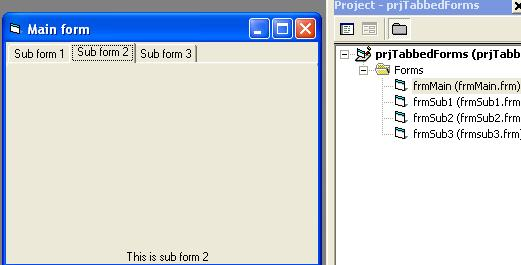

<div align="center">

## Embedded Forms \(Tabbed, 2 forms 1 window\)


</div>

### Description

This code allows you to embed a sub form unto a "main" form. Supports loading/unloading. Uses tabs to load and unload 3 simple sub forms.

This allows you to have cleaner code by splitting UIs into different forms instead of having invisible frames on the same form
 
### More Info
 
Takes mouse input for tabs, could be converted for buttons, images etc or keystrokes.

1: Sometimes there is a slight flicker when changing forms.

2: If you do not unload an embedded form when closing the program it will stay in memory.


<span>             |<span>
---                |---
**Submitted On**   |2008-02-27 15:04:24
**By**             |[James Chesterson](https://github.com/Planet-Source-Code/PSCIndex/blob/master/ByAuthor/james-chesterson.md)
**Level**          |Beginner
**User Rating**    |4.7 (14 globes from 3 users)
**Compatibility**  |VB 6\.0
**Category**       |[Custom Controls/ Forms/  Menus](https://github.com/Planet-Source-Code/PSCIndex/blob/master/ByCategory/custom-controls-forms-menus__1-4.md)
**World**          |[Visual Basic](https://github.com/Planet-Source-Code/PSCIndex/blob/master/ByWorld/visual-basic.md)
**Archive File**   |[Embedded\_F210429312008\.zip](https://github.com/Planet-Source-Code/james-chesterson-embedded-forms-tabbed-2-forms-1-window__1-70161/archive/master.zip)

### API Declarations

```
Private Declare Function SetParent Lib "user32" _
(ByVal hWndChild As Long, _
ByVal hWndNewParent As Long) As Long
```


